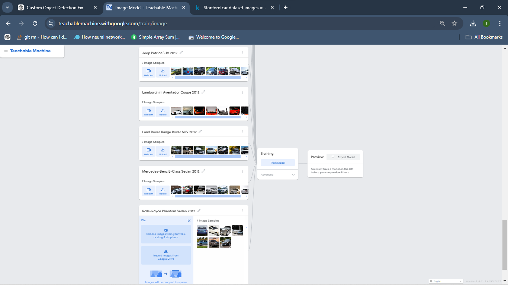
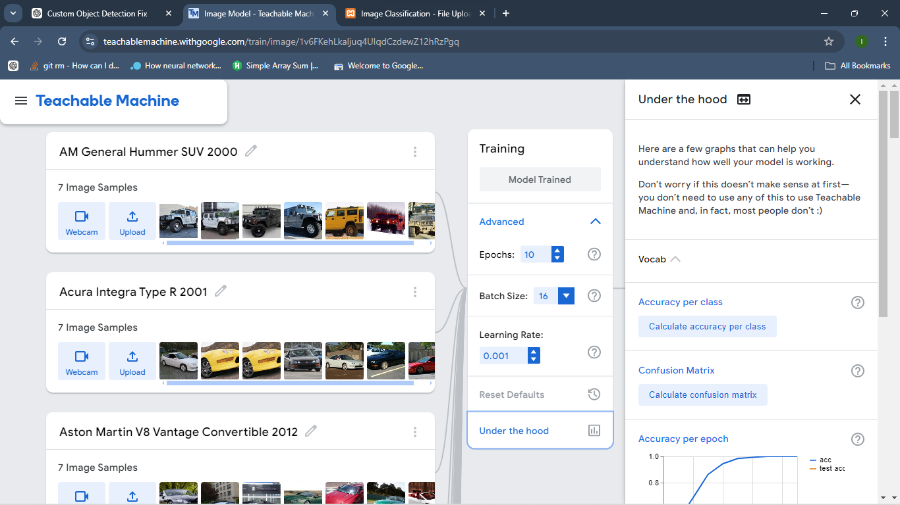
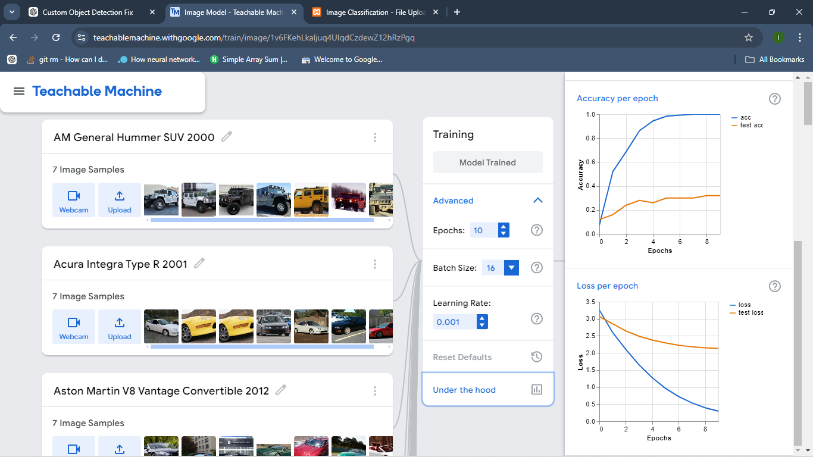
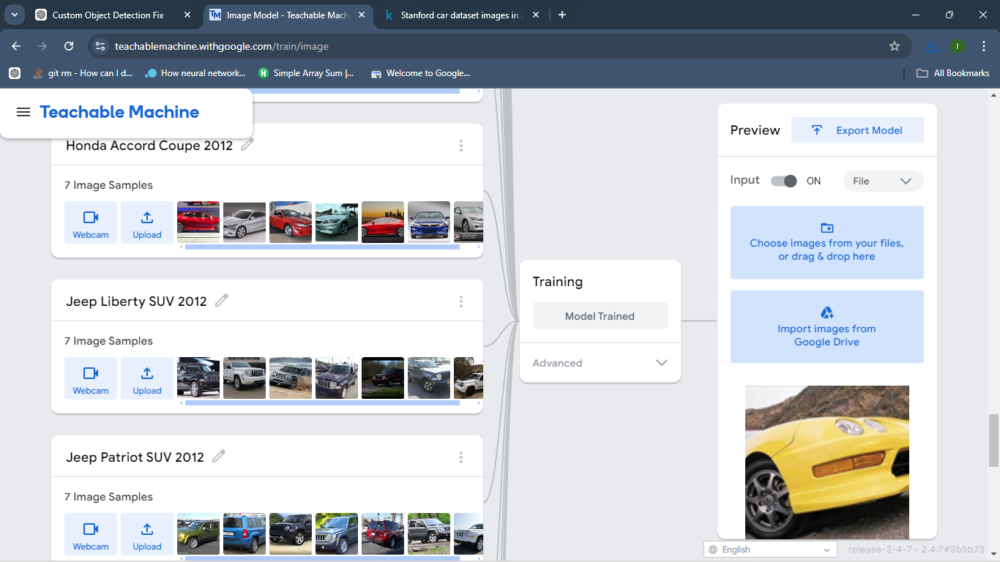

# 🚗 Vehicle Recognition System

This project is a **web-based vehicle recognition system** built using a custom-trained image classification model from [Teachable Machine](https://teachablemachine.withgoogle.com/) and powered by **TensorFlow.js**. The system can identify a vehicle's **make, model, and year** from an uploaded image using a model trained on the **Stanford Cars Dataset**.

---

## 🎯 Objective

To accurately classify and recognize vehicles using machine learning in the browser, without needing a backend server or cloud inference.

---

## 📦 Features

- ✅ Upload an image of a vehicle
- ✅ Predict the vehicle's make, model, and year
- ✅ Shows top prediction (and second if top confidence is low)
- ✅ Mobile-responsive user interface
- ✅ Built with **Vanilla JavaScript** and **TensorFlow.js**

---

## 🧠 Technologies Used

- **Teachable Machine (Image Classification)**
- **Stanford Cars Dataset (Training Images)**
- **TensorFlow.js**
- **Vanilla JavaScript**
- **HTML5 & CSS3**

---

## 🖼 Screenshot Previews

| Screenshot | Description |
|------------|-------------|
|  | Teachable Machine - uploading the dataset |
|  | Teachable Machine - training model |
|  | Teachable Machine - under the hood |
|  | Teachable Machine - Testing the model |

---

## ⚙️ How It Works

1. **Upload Image:**  
   A user selects a vehicle image via file input.

2. **Prediction:**  
   The image is passed to a Teachable Machine model trained on the Stanford Cars dataset.

3. **Result Display:**  
   The system shows the most likely match (make, model, year) and confidence level.

---

## 📁 Folder Structure

```

├── index.html
├── js/
│   ├── tf.min.js
│   └── teachablemachine-image.min.js
├── my\_model/
│   ├── model.json
│   └── metadata.json
├── screenshots/
│   ├── Screenshot1.png
│   ├── Screenshot2.png
│   ├── Screenshot3.png
│   └── Screenshot4.png

```

---

## 🔧 Setup Instructions

1. Clone or download the repository.
2. Export your trained model from [Teachable Machine](https://teachablemachine.withgoogle.com/) into the `my_model/` folder.
3. Open `index.html` in a browser and test by uploading vehicle images.

---

## 🔮 Future Enhancements

- Integrate bounding box object detection (e.g. YOLO or TensorFlow object detection)
- Add support for real-time webcam detection
- Expand dataset and class coverage
- Display more detailed vehicle specifications

---

## 📚 Acknowledgments

- [Stanford Cars Dataset](https://ai.stanford.edu/~jkrause/cars/car_dataset.html)
- [Google Teachable Machine](https://teachablemachine.withgoogle.com/)
- [TensorFlow.js](https://www.tensorflow.org/js)

---

## 📬 Contact

For questions or contributions, feel free to reach out.

- **Email:** tennwhiterose@gmail.com  
- **WhatsApp:** +2348148355580  
- **Twitter:** [@l9z1c0d9](https://x.com/l9z1c0d9), [@ComfyLearn](https://x.com/ComfyLearn), [@SoftBrein](https://x.com/SoftBrein)  
- **Website:** [SoftBrein](https://softbrein.tech/), [ComfyLearn](https://comfylearn.site/), [ComfyLearn Blog](https://blog.comfylearn.site/)  